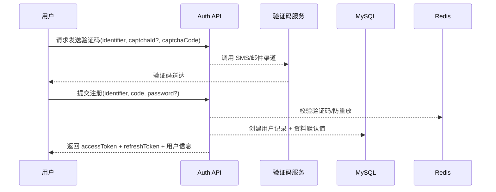

# 知光 登录注册技术方案（MVP v0.9）

> 范围：支撑产品计划书一期中“登录/注册/找回”能力，覆盖账号体系、验证码链路、会话管理与安全基线，面向 Java 21 + Spring Boot 3.x + MySQL 8.0 + Redis 7 单体应用。

---

## 1. 背景与目标
- **上线目标**：在 12 周 MVP 周期内提供稳定、低门槛的登录注册能力，支持手机号/邮箱验证码登录，可选密码，满足 D7 留存≥25% 前置条件。
- **成功标准**：
  - 注册成功率≥98%，验证码送达>97%，接口错误率<0.5%。
  - 登录体验首屏时间≤1.5s，鉴权接口 P95≤150ms。
  - 会话体系支持 JWT Access/Refresh，保障 99.9% 可用性。

---

## 2. 功能范围
- **注册**：手机号或邮箱 + 验证码；可选设置密码；需校验唯一性、黑名单。
- **登录**：验证码登录；支持密码登录（当用户已设置）；多端并存，刷新令牌续期。
- **验证码服务**：图形验证码（防刷）+ 短信/邮件发送，限流与重试策略。
- **找回/重置密码**：验证码校验后重置密码。
- **会话管理**：JWT（RS256）签发、续签、登出（Refresh Token 轮换）、设备指纹预留。
- **账号资料基础**：注册成功后生成用户档案，支持后续资料补全。

超出范围：第三方登录、设备列表、踢下线、双因素验证、企业账号。

---

## 3. 用户流程
### 3.1 注册流程

### 3.2 登录流程（验证码 & 密码）
- 验证码：同注册校验成功后签发 JWT。
- 密码：BCrypt 比对成功签发 JWT，若密码尝试失败 5 次触发冷却。

### 3.3 找回密码
1. 验证码验证成功后进入重置密码态。
2. 密码写入 users.password_hash，记录审计日志。

---

## 4. 技术架构
- **模块划分**：
  - `auth-service`（Spring MVC + Spring Security）：暴露 `/api/v1/auth/*`。
  - `verification-service`：封装短信/邮件网关，统一 Redis 存储。
  - `user-domain`：管理用户实体 CRUD 与资料同步。
- **依赖组件**：
  - MySQL 8.0：`users`、`password_histories?`、`login_logs`。
  - Redis 7：验证码缓存、频控计数、黑名单、Refresh Token 白名单。
  - 第三方渠道：阿里云短信 / SendGrid 邮件（可插拔）。
- **部署**：单体应用，容器化发布；Redis 与 MySQL 独立托管服务；配置中心（Spring Config）管理敏感信息。

---

## 5. 数据模型
### 5.1 主表 `users`
| 字段 | 类型 | 说明 |
| --- | --- | --- |
| id | BIGINT PK | 使用雪花 ID |
| phone | VARCHAR(32) | 手机号，唯一索引，可空 |
| email | VARCHAR(128) | 邮箱，唯一索引，可空 |
| password_hash | VARCHAR(128) | BCrypt（12+ cost），无密码用户为空 |
| nickname | VARCHAR(64) | 默认生成（如“知光用户xxxx”） |
| avatar | TEXT | 预设默认头像 |
| bio | VARCHAR(512) | 空 |
| tags_json | JSON | 空数组 |
| created_at/updated_at | TIMESTAMP | |

### 5.2 辅助表
- `verification_codes`（Redis Key `vcode:{scene}:{identifier}`）：值包含验证码、过期时间、错误次数。
- `login_logs`：记录登录时间、IP、UA、渠道，用于风控与运营。
- `refresh_tokens`（Redis `rt:{userId}:{jti}`）：存储刷新令牌状态，支持失效与轮换。

---

## 6. 接口设计
- **POST `/api/v1/auth/send-code`**
  - 请求：`{scene: register|login|reset, identifier: phone|email, captchaToken?}`
  - 响应：`{traceId, expireIn}`；频控：同 identifier 60s 内 1 次、日累计 10 次。
- **POST `/api/v1/auth/register`**
  - 请求：`{identifier, code, password?, agreeTerms}`。
  - 响应：`{user, accessToken, refreshToken}`；注册时写审计日志。
- **POST `/api/v1/auth/login`**
  - 请求：`{identifier, code? , password?}`；根据参数自动识别模式。
  - 响应：`{accessToken, refreshToken, user}`；Access 15min，Refresh 7d。
- **POST `/api/v1/auth/token/refresh`**
  - 请求：`{refreshToken}`；校验 Redis 白名单 + JWT。
  - 响应：新 `accessToken/refreshToken`（轮换策略）。
- **POST `/api/v1/auth/logout`**
  - 请求头携带 Authorization；刷新令牌加入黑名单。
- **POST `/api/v1/auth/password/reset`**
  - 请求：`{identifier, code, newPassword}`；强制密码复杂度。

所有接口返回统一 `traceId`，遵循产品计划书的安全、监控要求。

---

## 7. 业务规则与策略
- **账号唯一性**：注册前校验 phone/email 不存在；并发场景通过数据库唯一索引 & 幂等 token 处理。
- **验证码策略**：
  - 长度 6 位数字，5 分钟过期。
  - 错误次数≥5 锁定 30 分钟，Redis 记录。
  - 发送前需校验图形验证码（防脚本）。
- **密码策略**：≥8 位，包含字母与数字；BCrypt 哈希；存储前截断空格。
- **JWT 策略**：RS256，私钥保存在密钥管理；Access Token 15 分钟；Refresh Token 7 天；支持滑动续期。
- **登录风控**：IP 黑名单、地理异常提醒预留；同 IP 登录失败 10 次触发二次验证。
- **审计日志**：注册、登录成功/失败、密码修改写入 `audit_log`。

---

## 8. 安全设计
- **传输安全**：HTTPS 强制；HSTS；禁止明文重定向。
- **敏感信息保护**：密码哈希（BCrypt）；验证码、Token 不入日志；手机号/邮箱脱敏后写日志。
- **CSRF 防护**：登录注册接口接受跨域预检，仅允许白名单域；非 Cookie 会话（JWT）默认安全，但前端需存储在 `httpOnly` Cookie。
- **频控与防刷**：基于 Redis 令牌桶（per IP、per identifier）；接入图形验证码、行为验证码扩展点。
- **XSS/注入**：参数校验 + Spring Validation；统一序列化。

---

## 9. 观测与运维
- **Metrics**：验证码发送成功率/失败原因、登录成功率、平均响应时间、Redis 命中率。
- **Logging**：结构化日志，字段含 `traceId/userId/ip/device`；敏感内容脱敏。
- **Tracing**：接入 OpenTelemetry，关键 span：发送验证码、数据库插入、JWT 签发。
- **告警**：验证码失败率>5%、登录失败率>10%、Redis 连接数异常等触发告警。

---

## 10. 测试计划
- **单元测试**：验证码生成校验、密码哈希、JWT 服务、限流策略。
- **集成测试**：注册-登录闭环、Refresh Token 轮换、验证码过期/错误分支、并发注册冲突。
- **性能测试**：验证码接口 & 登录接口双峰（2k QPS）压测；Redis 限流命中率验证。
- **安全测试**：暴力破解、短信轰炸、JWT 伪造、越权访问。

---

## 11. 里程碑 & 排期（建议）
- **W1**：方案评审、接口契约、第三方渠道采购。
- **W2**：验证码服务接入、Redis 限流实现。
- **W3**：注册/登录/找回接口开发、自测。
- **W4**：集成测试、性能压测、监控接入、预发布演练。

---

## 12. 风险与对策
| 风险 | 影响 | 应对 |
| --- | --- | --- |
| 验证码被滥用 | 成本增加/账号垃圾 | 频控 + 行为验证码 + 黑名单 |
| 渠道故障 | 无法登录注册 | 双渠道（短信/邮件）兜底，监控切换 |
| Token 泄露 | 账号被盗 | Refresh Token 白名单 + 设备异常检测 + 用户可强制登出（预留） |
| 并发注册撞库 | 重复账号/错误 | 幂等业务键 + DB 唯一索引 + 重试机制 |

---

## 13. 后续扩展
- 设备管理、踢下线、二次验证、第三方登录能力在二期扩展。
- 与风控/内容安全平台联动，实现登录风险识别与阻断。

