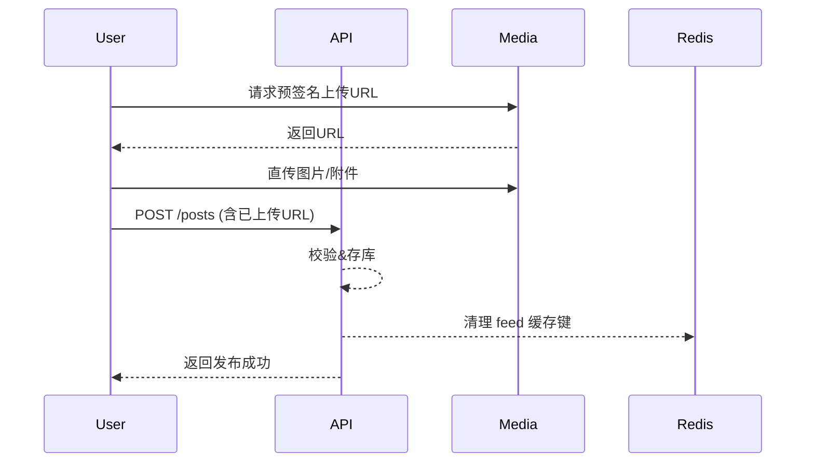
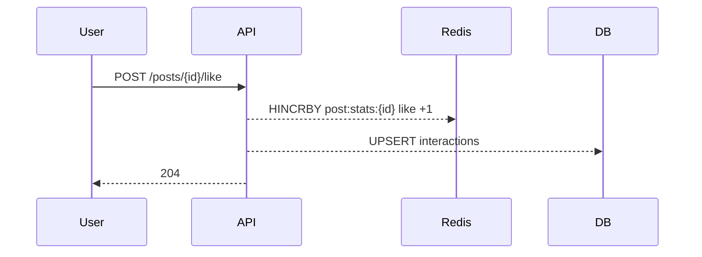

# 知光 产品计划书（Feed+图文+文档）MVP v0.9

> 范围：一期仅支持**登录注册/资料编辑**、**发布图文与纯文档（Markdown 渲染）**、**首页Feed混排+详情页**、**关注/点赞/收藏**、**评论互动**。技术栈：**Java 21 + Spring Boot 3.x + MySQL 8.0 + Redis 7**（模块化单体，预留解耦）。

---

## 0. 目标与指标
- 核心目标：12 周内上线闭环，验证供给—分发—互动—留存。
- 业务指标：
  - D7 留存≥25%；日均发帖≥100；日均有效互动（赞/藏/评）≥800；
  - 首屏加载≤1.5s（国内节点），Feed 滚动分页 P95≤300ms；
  - 系统可用性≥99.9%，核心接口错误率<0.5%。

---

## 1. 需求范围（FRD）
### 1.1 账号 & 资料
- **登录/注册/找回**：手机号+验证码 / 邮箱+验证码（二选一起步）；密码可选。
- **会话**：JWT（Access/Refresh）；踢下线与设备列表（可二期）。
- **用户信息**：头像、昵称、简介、主页链接、职业/学校（可选）、标签（多选）。
- **隐私**：黑名单/拉黑（可二期）；内容可见性默认公开。

### 1.2 发布知识（一期形态）
- **图文 Post**：标题、正文（富文本/Markdown）、图片多图（≤9）、标签、多级类目。
- **纯文档 Doc**：Markdown 上传或在线编辑，渲染预览，自动生成目录（TOC）。
- **草稿/发布**：自动保存草稿；发布前校验（敏感词/长度/图片格式）。
- **资源存储**：图片直传对象存储（S3/OSS 兼容）→ 回写 URL；文档存储 Markdown 源+渲染 HTML。

### 1.3 首页 Feed & 详情页
- **混合排布**：图文卡片（封面图+摘要）与文档卡片（标题+文档徽标+节选）混排；顶部**分类标签**（可多选）与“最新/最热”切换。
- **排序**：
  - 最新流：按发布时间倒序；
  - 最热流：时间衰减加权（点赞/收藏/评论/完读率），去重与同作者相邻控制。
- **详情页**：作者信息、正文/渲染区、目录（文档）、标签、互动条（赞/藏/评）、相关推荐（同标签近邻）。

### 1.4 社交与互动
- **关注/取关**：作者主页与卡片上可操作；提供“关注流”。
- **点赞/收藏**：幂等；去重；我的点赞与收藏列表。
- **评论**：一级评论 + 楼层回复（最多二级）；@提及（一期仅文本提示）。
- **举报**：基础文本/图片举报，后台审核。

---

## 2. 非功能需求（NFR）
- **安全**：
  - 密码哈希（BCrypt）；敏感字段脱敏；
  - CSRF 防护、JWT RS256 签名、接口频控（令牌桶）；
  - 文本/图片机审接口预留（敏感词、NSFW）。
- **性能**：
  - Feed 首屏≤1.5s（CDN + 预渲染封面/摘要）；
  - 列表分页 20/页，滚动增量加载；
  - MySQL 热表 QPS≥2k，Redis 命中≥90%。
- **可观测**：
  - Trace：requestId 贯穿；
  - Metrics：RPS、P95、DB 慢查询、缓存命中、错误率；
  - 日志：关键动作（发帖/删帖/关注/点赞/收藏/评论）。

---

## 3. 领域与数据模型（ER）
- **User**(id, phone/email, password_hash?, nickname, avatar, bio, tags_json, created_at)
- **Follow**(follower_id, followee_id, created_at)  — 复合唯一索引
- **Post**(id, author_id, type[note|doc], title, cover, summary, content_md, content_html, images_json, tags_json, status[draft|published|hidden], created_at)
- **Interaction**(id, user_id, post_id, type[like|favorite], created_at) — 幂等唯一 (user_id, post_id, type)
- **Comment**(id, post_id, user_id, parent_id?, content, status, created_at)
- **Tag**(id, name, path)
- **PostTag**(post_id, tag_id)
- **AuditLog**(id, actor_id, target_type, target_id, action, diff_json, created_at)

索引建议：
- Post(author_id, type, status, created_at desc)、FULLTEXT(title, summary, content_html)（MySQL InnoDB FTS）；
- Interaction(post_id, type)、Interaction(user_id, type)；
- Comment(post_id, created_at)；
- Follow(follower_id, followee_id unique)。

---

## 4. API 设计（REST v1）
> 前缀 `/api/v1`；鉴权 Bearer JWT；下文仅列关键接口。

### 4.1 账号与资料
- POST `/auth/register` `{phone/email, code, password?}`
- POST `/auth/login` `{identifier, password? | code}` → `{accessToken, refreshToken}`
- POST `/auth/token/refresh`
- GET `/me` / PUT `/me` `{nickname, avatar, bio, tags[]}`

### 4.2 发布与资源
- POST `/posts` `{type, title, content_md, images[], tags[]}`
- PUT `/posts/{id}` / DELETE `/posts/{id}`
- GET `/posts/{id}`（渲染HTML + TOC 对于 doc）
- POST `/media/upload` （预签名直传，服务端落库）

### 4.3 Feed 与详情
- GET `/feed` `?tab=latest|hot|following&tag=&type=`
- GET `/posts?authorId=&type=&tag=&page=`

### 4.4 关注/点赞/收藏
- POST `/users/{id}/follow` / DELETE `/users/{id}/follow`
- POST `/posts/{id}/like` / DELETE `/posts/{id}/like`
- POST `/posts/{id}/favorite` / DELETE `/posts/{id}/favorite`
- GET `/me/likes`、`/me/favorites`、`/me/follows`

### 4.5 评论
- GET `/posts/{id}/comments` `?page=`
- POST `/posts/{id}/comments` `{content, parentId?}`
- DELETE `/comments/{id}`（作者/管理员）

> 统一错误：`{code, message, requestId}`；常见：`AUTH_401`, `VALID_422`, `RATE_429`, `NOTFOUND_404`。

---

## 5. 技术架构（Java 21 + MySQL 8 + Redis）
### 5.1 选型
- Java 21、Spring Boot 3.x、Spring Security、Spring Data JPA/MyBatis（选其一）
- MySQL 8.0（主从 + 读写分离）、Redis 7（缓存/会话/限流）
- 对象存储：MinIO（本地）/OSS/S3（生产）；
- 网关：Nginx；构建：Maven + Docker；
- 观测：Micrometer + OpenTelemetry → Prometheus/Grafana；ELK/EFK。

### 5.2 模块化单体（后续可解耦）
- `auth`、`user`、`post`、`feed`、`interaction`、`comment`、`media` 模块；
- 内部事件总线（Spring 事件）用于解耦“发帖→Feed 索引更新”。

### 5.3 缓存与读写策略
- **缓存键**：`post:{id}`、`feed:latest:{page}`、`feed:hot:{page}`、`user:{id}`、`user:followers:{id}`、`post:stats:{id}`（赞/藏计数）；
- **失效**：写后删除相关列表键；热门Feed使用 Redis ZSET（时间戳+热度分）。
- **计数**：点赞/收藏计数采用 Redis Hash + 定时落库（或流水表聚合）。

### 5.4 简化推荐/排序
- 热度分：`score = a*like + b*favorite + c*comment + d*readCompletion - e*timeDecay`（a,b,c,d,e 可调）；
- 最新流：按 `created_at desc`。

### 5.5 安全与风控
- 登录限流、发帖/评论频控；
- 文本敏感词扫描（Trie/云接口）；
- 图片安全扫描（云 API 预留）。

---

## 6. 数据库设计（MySQL 8 DDL 片段）
```sql
CREATE TABLE users (
  id BIGINT PRIMARY KEY AUTO_INCREMENT,
  email VARCHAR(128), phone VARCHAR(32), password_hash VARCHAR(128),
  nickname VARCHAR(64) NOT NULL, avatar TEXT, bio VARCHAR(512), tags_json JSON,
  created_at TIMESTAMP DEFAULT CURRENT_TIMESTAMP,
  UNIQUE KEY uk_email (email),
  UNIQUE KEY uk_phone (phone)
) ENGINE=InnoDB;

CREATE TABLE posts (
  id BIGINT PRIMARY KEY AUTO_INCREMENT,
  author_id BIGINT NOT NULL,
  type ENUM('note','doc') NOT NULL,
  title VARCHAR(200) NOT NULL,
  cover TEXT,
  summary VARCHAR(400),
  content_md MEDIUMTEXT,
  content_html MEDIUMTEXT,
  images_json JSON,
  tags_json JSON,
  status ENUM('draft','published','hidden') DEFAULT 'published',
  created_at TIMESTAMP DEFAULT CURRENT_TIMESTAMP,
  KEY ix_posts_author (author_id, created_at DESC),
  FULLTEXT KEY ftx_posts (title, summary, content_html)
) ENGINE=InnoDB;

CREATE TABLE follows (
  follower_id BIGINT NOT NULL,
  followee_id BIGINT NOT NULL,
  created_at TIMESTAMP DEFAULT CURRENT_TIMESTAMP,
  PRIMARY KEY (follower_id, followee_id)
) ENGINE=InnoDB;

CREATE TABLE interactions (
  id BIGINT PRIMARY KEY AUTO_INCREMENT,
  user_id BIGINT NOT NULL,
  post_id BIGINT NOT NULL,
  type ENUM('like','favorite') NOT NULL,
  created_at TIMESTAMP DEFAULT CURRENT_TIMESTAMP,
  UNIQUE KEY uk_user_post_type (user_id, post_id, type),
  KEY ix_interactions_post (post_id, type)
) ENGINE=InnoDB;

CREATE TABLE comments (
  id BIGINT PRIMARY KEY AUTO_INCREMENT,
  post_id BIGINT NOT NULL,
  user_id BIGINT NOT NULL,
  parent_id BIGINT NULL,
  content TEXT NOT NULL,
  status ENUM('normal','hidden','deleted') DEFAULT 'normal',
  created_at TIMESTAMP DEFAULT CURRENT_TIMESTAMP,
  KEY ix_comments_post (post_id, created_at)
) ENGINE=InnoDB;
```

---

## 7. 接口时序（Mermaid）
**发布图文/文档**


**点赞/收藏**


---

## 8. 测试与验收
- **单元**：服务层覆盖≥70%，发布/Feed/互动关键路径≥85%。
- **集成**：直传、渲染、分页、去重、幂等、频控、全文检索。
- **性能**：Feed 列表≥1k QPS，详情≥800 QPS；
- **安全**：XSS（Markdown 渲染时白名单）、CSRF、JWT 伪造、越权；
- **验收**：产品走查清单+监控面板达标。

---

## 9. 里程碑（12 周）
- W1–2：ER/接口设计、原型（Feed/详情/发布）。
- W3–5：账号/发布/媒体直传/Markdown 渲染。
- W6–7：Feed/详情/关注/点赞/收藏。
- W8：评论与举报；全文检索；
- W9：缓存与性能优化、观测接入；
- W10：封测与修复；W11：灰度；W12：公开内测。

---

## 10. 风险与对策
| 风险 | 影响 | 对策 |
|---|---|---|
| 垃圾内容/违规 | 影响品牌 | 敏感词机审+人工抽检+举报通道+频控 |
| 热点穿透数据库 | 性能抖动 | Redis 缓存+热点键本地缓存+降级 |
| Markdown XSS | 安全风险 | 渲染白名单（GFM 基础）+ 链接 rel=noopener |
| 盗链 | 资源外泄 | 直传域名隔离+签名URL+Referer 校验 |

---

## 11. 附：渲染与前端约定
- Markdown：GFM 子集，代码高亮（Prism.js），表格、列表、标题、引用、图片；
- 图片：自适应等比缩放，生成多规格缩略图；
- 卡片：图文卡显示首图+前200字；文档卡显示标题+目录摘要；
- 无障碍：图片 alt 必填，颜色对比度 AA。

> 本计划书仅覆盖一期范围；后续将扩展订阅制、系列内容、搜索/推荐、创作者中心与内容审核台。

